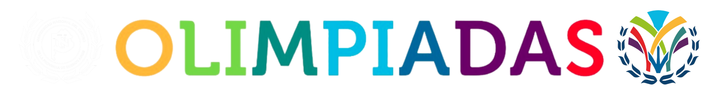

# Olimpiadas UNICEN

Aplicación web de las Olimpiadas Interfacultativas de la UNICEN.

## Índice

- [¿Cómo se estructura el proyecto?](resources/markdown/estructura.md)
- [¿Qué necesito para ejecutar la aplicación?](resources/markdown/requisitos.md)
- [¿Cómo ejecuto la aplicación?](resources/markdown/ejecución.md)

## Créditos

Este proyecto fue realizado por estudiantes de la carrera de Ingeniería en Sistemas, como proyecto integrador de las materias Programación Web y Sistemas Operativos.

Los alumnos que trabajaron en este proyecto son:

- Roumec, Iñaki. <iroumec@alumnos.exa.unicen.edu.ar>.
- Velis, Ulises. <uvelis@alumnos.exa.unicen.edu.ar>.
- Zaffaroni, Gerónimo. <gzaffaroni@alumnos.exa.unicen.edu.ar>.
