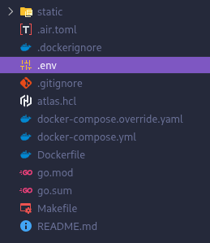

# Requirements

The only requirements for the application are Docker and the configuration of environment variables.

## Docker on Linux

You must have [Docker Engine](https://docs.docker.com/engine/install/) or [Docker Desktop](https://www.docker.com/products/docker-desktop/) installed on your system.

If you install Docker Engine, you can grant Docker administrator permissions by running the following commands:

```sh
sudo usermod -aG docker $USER \
&& newgrp docker
```

> [!TIP]
> These commands work on most distributions (Debian, Ubuntu, Fedora, Arch, openSUSE, etc.). If the `docker` group does not exist, create it manually with `sudo groupadd docker`.

These commands must be executed **only once** after installing Docker Engine.

> [!IMPORTANT]
> The image runs in isolated mode, without root privileges inside the container. Therefore, doing this is safe as long as you do not modify the program files.

### Docker on macOS/Windows

Download [Docker Desktop](https://www.docker.com/products/docker-desktop/).

Unlike Linux, Docker Desktop runs in the background with sufficient permissions, so no additional configuration is required.

## Environment configuration

You must define a file with the environment variables. To do so, you can use the example file as a base:

```bash
cp resources/.env.example .env
```

Then, edit `.env` and replace the default values with the requested credentials.

> [!TIP]
> The credentials in the `.env.example` file are already prepared for the program to work correctly. Therefore, you only need to copy them into a `.env` file in the root directory. The result should look like this:
>
> 

---

Once everything is ready, you can run the application. [How do I run the application?](execution.md).

---
