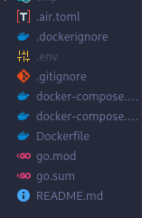

# Requisitos

Los únicos requisitos de la aplicación son Docker y la configuración de las variables de entorno.

## Docker en Linux

Debe tener instalado [Docker Engine](https://docs.docker.com/engine/install/) o [Docker Desktop](https://www.docker.com/products/docker-desktop/) en su sistema.

En caso de instalar Docker Engine, puede otorgarle permisos de administrador a Docker mediante los siguientes comandos:

```sh
sudo usermod -aG docker $USER \
&& newgrp docker
```

> [!TIP]
> Estos comandos funcionan en la mayoría de las distribuciones (Debian, Ubuntu, Fedora, Arch, openSUSE, etc.). Si el grupo docker no existe, créelo manualmente con `sudo groupadd docker`.

Estos comandos deben ejecutarse **una sola vez** después de instalar Docker Engine.

> [!IMPORTANT]
> La imagen corre en modo aislado, sin privilegios de root dentro del contenedor. Por lo tanto, realizar esto es seguro siempre y cuando no modifique los archivos del programa.

### Docker en macOS/Windows

Descargue [Docker Desktop](https://www.docker.com/products/docker-desktop/).

A diferencia de Linux, Docker Desktop corre en segundo plano con los permisos suficientes, por lo que no hace falta ninguna configuración adicional.

## Configuración del entorno

Es necesario que defina un archivo con las variables de entorno. Para ello puede basarse en el archivo de ejemplo:

```bash
cp resources/.env.example .env
```

Luego, debe editar `.env` y remplazar los valores por defecto con sus credenciales solicitadas.

> [!Tip] Las credenciales en el archivo `.env.example` ya están preparadas para que el programa funcione sin problemas. Por lo tanto, solo debe copiarlas en un archivo .env dentro de la carpeta principal. El resultado debería verse así: 

---

Con todo esto listo, ya puede ejecutar la aplicación. [¿Cómo ejecuto la aplicación?](ejecución.md).

---
